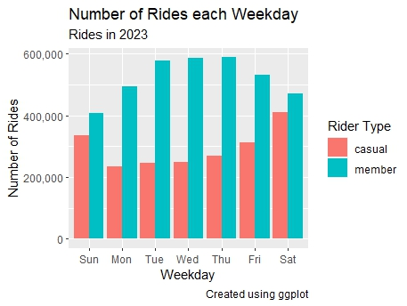
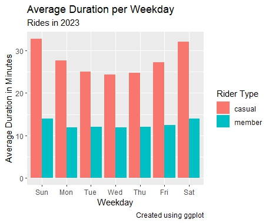

# Cyclistic Case Study
## Google Data Analytics Certificate
I am doing an analysis for a fictitious company named Cyclistic but using data from Divvy a bike share company based in Chicago, Illinois for the year 2023. I got the data from https://divvy-tripdata.s3.amazonaws.com/index.html under this license https://divvybikes.com/data-license-agreement
* I have a Google slides presentation for this project located here 
[my google slide show](https://docs.google.com/presentation/d/e/2PACX-1vTtKp3O9r1-blmMNVPyWy32rfsWA2NxB-2UgAct4anHn48oSrUpcFaZHo4cz3rzQdW0HMuNNe0nZ30p/pub?start=false&loop=false&delayms=3000)
* I have a kaggle notebook for this project also [my kaggle notebook](https://www.kaggle.com/code/andrewhinkson/cyclistic-bike-share-case-study)

### Objective
How do annual and casual riders use Cyclistic bikes differently?

With an in depth analysis of bike rentals for the year 2023, we can determine the different ways that annual and casual riders use our bikes. This will allow our marketing team to develop different campaigns that target our casual members and convert them to annual members.

### Visualizations
Visualization of the number of rides by rider type each weekday

Visualization of the average ride length per weekday

### Observations
* Members ride more frequently Monday through Friday on average compared to casual riders who are more active on the weekends. 
* Members use the bikes on average 10 minutes at a time whereas casual riders double or even triple that use time, especially on weekends.

### Recommendations to Marketing Team
* On weekends the team could target casual riders with deals that make the annual membership more appealing.
* Based on the data members spend less time with each trip. Using that the team would state there is no need to keep hauling the bike around after a trip. The rider can end the trip and start another one the same day at no extra cost.
* Throughout the week marketing could target the benifits of bike riding in the city. Saves time, money, and gas. Annual members benefit from this and should be shown as a positive to casual riders.